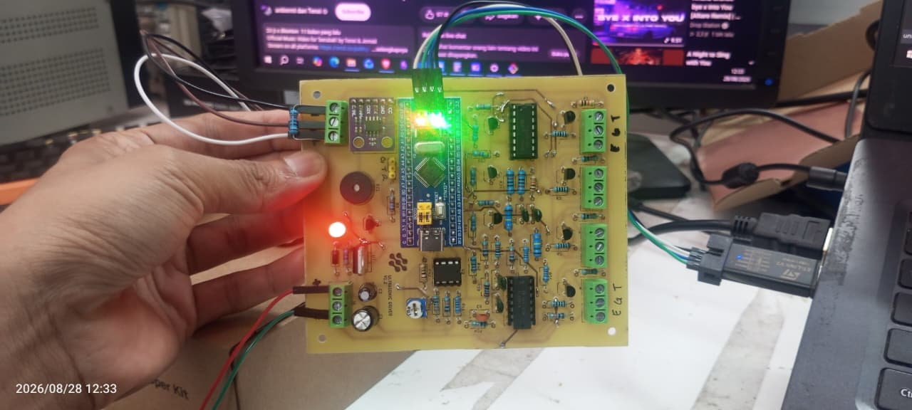

# STM32 Ultrasonic Driver

Firmware for **STM32F103C8T6 (Blue Pill)** used as a 4-channel ultrasonic sensor driver with distance data transmitted over **CAN Bus**.



## Features

* 4-channel ultrasonic sensor
* ~40 kHz ultrasonic burst
* 8-cycle burst
* Echo time measurement using DWT
* EMA distance filtering
* Outlier rejection
* Buzzer warning
* CAN Bus @ 500 kbps
* UART debug @ 115200 baud

---

## Hardware

| Component       | Specification        |
| --------------- | -------------------- |
| MCU             | STM32F103C8T6        |
| Ultrasonic      | 4 Channels           |
| CAN Transceiver | MCP2551 / Compatible |
| CAN Bitrate     | 500 kbps             |
| UART            | USART3 @ 115200      |
| System Clock    | 72 MHz               |

---

## Pin Configuration

### Ultrasonic

| Function    | Pin  |
| ----------- | ---- |
| Trigger CH1 | PA11 |
| Trigger CH2 | PA10 |
| Trigger CH3 | PA9  |
| Trigger CH4 | PA8  |
| Echo        | PA0  |
| Selector 1  | PB5  |
| Selector 2  | PB4  |
| Selector 3  | PB3  |
| Buzzer      | PA6  |

### Channel Selection

| Channel | SEL1 | SEL2 | SEL3 |
| ------- | ---: | ---: | ---: |
| CH1     | HIGH | HIGH | HIGH |
| CH2     | HIGH |  LOW | HIGH |
| CH3     | HIGH | HIGH |  LOW |
| CH4     | HIGH |  LOW |  LOW |

---

## Ultrasonic Configuration

```c
#define BURST_CYCLE            8U
#define BLANKING_US            1000UL
#define LISTEN_US              3000UL
#define SPEED_OF_SOUND_CM_US   0.0343f
#define DIST_OFFSET            -5.0f
```

Ultrasonic frequency:

```text
~40 kHz
```

Maximum theoretical detection range with `LISTEN_US = 3000`:

```text
~51.45 cm
```

---

## Distance Filtering

```c
#define FILTER_ALPHA        0.3f
#define MAX_JUMP_CM         15.0f
#define OUTLIER_ALPHA       0.1f
#define NO_ECHO_CONFIRM     3
```

If no echo is detected for 3 consecutive measurements, the distance is considered invalid and set to:

```text
999 cm
```

---

## Buzzer

The buzzer is connected to **PA6**.

|   Distance | Buzzer |
| ---------: | ------ |
|  `< 24 cm` | Fast   |
| `24–30 cm` | Slow   |
|  `> 30 cm` | OFF    |
|    No Echo | OFF    |

Thresholds can be modified in the source code:

```c
const float distance_close  = 24.0;
const float distance_medium = 30.0;
```

---

# CAN Bus

## Configuration

```text
Bitrate        : 500 kbps
CAN Controller : CAN1
Frame Type     : Standard ID
DLC            : 8
TX Rate        : 50 Hz
```

CAN timing:

```c
Prescaler = 4
SJW        = 1TQ
TimeSeg1   = 13TQ
TimeSeg2   = 4TQ
```

### CAN Mode

For communication with an external CAN node:

```c
hcan.Init.Mode = CAN_MODE_NORMAL;
```

`CAN_MODE_LOOPBACK` should only be used for internal testing.

---

## CAN Protocol

The four distance values are transmitted as `float32` using two CAN frames.

### CAN ID `0x400`

```text
Byte 0-3 : CH1 float32
Byte 4-7 : CH2 float32
```

### CAN ID `0x401`

```text
Byte 0-3 : CH3 float32
Byte 4-7 : CH4 float32
```

| CAN ID  | DLC | Data      |
| ------- | --: | --------- |
| `0x400` |   8 | CH1 + CH2 |
| `0x401` |   8 | CH3 + CH4 |

Data format:

```text
IEEE-754 float32
Little-endian
```

Example Python decoding:

```python
import struct

ch1, ch2 = struct.unpack("<ff", msg.data)
```

---

# UART Debug

```text
Interface : USART3
Baudrate  : 115200
Data      : 8-bit
Parity    : None
Stop Bit  : 1
```

Example output:

```text
Ultrasonic system ready

| CH1 25.34 cm
| CH2 31.22 cm
| CH3 No Echo
| CH4 45.12 cm
```

---

# Project Configuration

Developed using:

```text
STM32CubeIDE
STM32 HAL
STM32F103C8T6
```

Main configuration:

```text
System Clock : 72 MHz
CAN          : CAN1
Timer        : TIM1
UART         : USART3
Echo         : EXTI0 / PA0
```

---

# CAN Wiring

Connect the CAN transceiver to the CAN network:

```text
STM32 CANH ───────── CANH
STM32 CANL ───────── CANL
GND       ───────── GND
```

Use a **120 Ω termination resistor** at both physical ends of the CAN bus.

```text
120Ω                         120Ω
 │                            │
CANH ======================== CANH
CANL ======================== CANL
 │                            │
STM32                        CAN Node
```

---

# Build & Flash

1. Open the project in **STM32CubeIDE**.
2. Make sure the `.ioc` configuration matches the hardware.
3. Build the project.
4. Flash the firmware to the STM32F103C8T6 using an ST-Link.
5. Connect the CAN transceiver and ultrasonic sensors.
6. Set `CAN_MODE_NORMAL` when communicating with an external CAN node.

---

# CAN Monitoring

On Linux/Jetson with SocketCAN:

```bash
candump can0
```

Expected frames:

```text
can0  400   [8]  XX XX XX XX XX XX XX XX
can0  401   [8]  XX XX XX XX XX XX XX XX
```

Id 400 is for sensor 1-2 and Id 401 is used for sensor 3-4 , data type (float)

---

## Author

**STM32 Ultrasonic Driver**

Developed for an AGV ultrasonic sensing system.
